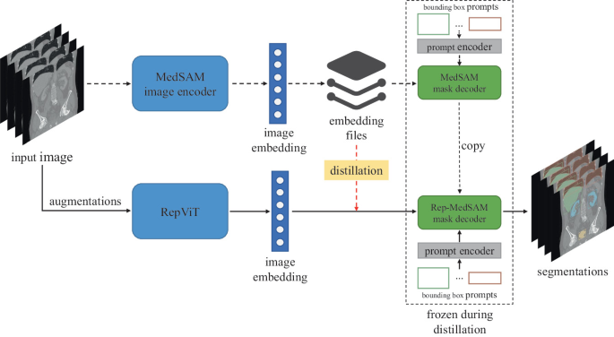
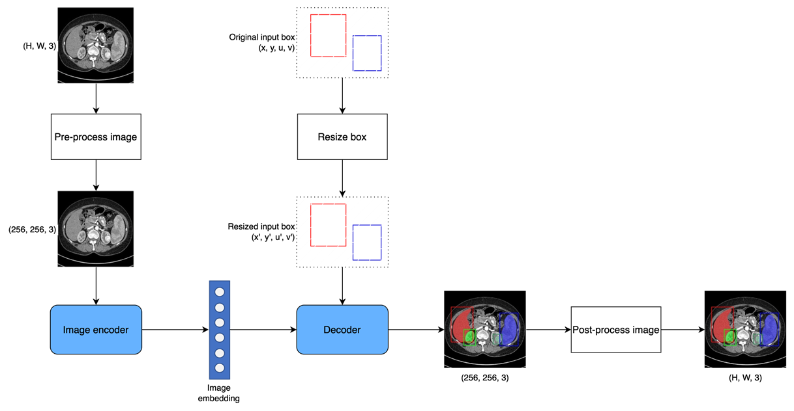

# <p align="center">Rep-MedSAM C++: High-Performance Inference Pipeline for Edge Devices</p>

<p align="center">


</p>

## Inference Time Comparison
<div style="display: flex; justify-content: center;">

<div style="flex: 1;">
<h3 align="left">2D images</h3>

| **Target**   | **Rep-MedSAM (s)** | **Rep-MedSAM C++ (s)** | **Reduction (%)** |
|:-------------|:-------------------|:-----------------------|:------------------|
| CT           | 1.13               | **0.47**               | 58.41             |
| MR           | 0.85               | **0.46**               | 45.88             |
| US           | 0.76               | **0.42**               | 44.74             |
| X-Ray        | 1.20               | **0.67**               | 44.17             |
| Dermoscopy   | 0.97               | **0.62**               | 36.08             |
| Endoscopy    | 0.76               | **0.41**               | 46.05             |
| Fundus       | 0.90               | **0.52**               | 42.22             |
| Microscope   | 9.88               | **6.10**               | 38.26             |
| **Average**  | **2.06**           | **1.21**               | **41.26**         |

</div>

<div style="flex: 1;">
<h3 align="left">3D images</h3>

| **Target**   | **Rep-MedSAM (s)** | **Rep-MedSAM C++ (s)** | **Reduction (%)** |
|:-------------|:-------------------|:-----------------------|:------------------|
| CT           | 76.44              | **25.06**              | 67.22             |
| MR           | 50.63              | **14.59**              | 71.18             |
| PET          | 7.23               | **3.30**               | 54.36             |
| **Average**  | **44.77**          | **14.32**              | **68.01**         |

</div>

</div>

<h3 align="left">Performance comparison for individual test cases</h3>

| **Case**                 | **Size**             | **Rep-MedSAM (s)**    | **Rep-MedSAM C++ (s)**    |
|:-------------------------|:---------------------|:----------------------|:--------------------------|
| 3DBox_CT_0566            | (287, 512, 512)	  | 390.55                | **100.02**                |
| 3DBox_CT_0888            | (237, 512, 512)      | 104.86                | **36.20**                 |
| 3DBox_CT_0860            | (246, 512, 512)      | 15.32                 | **8.56**                  |
| 3DBox_MR_0621            | (115, 400, 400)      | 166.56                | **34.32**                 |
| 3DBox_MR_0121            | (64, 290, 320)       | 116.01                | **20.03**                 |
| 3DBox_MR_0179            | (84, 512, 512)       | 15.38                 | **7.37**                  |

## Getting Started

```bash
git clone --recursive https://github.com/nghia051/rep-medsam-cpp.git
cd rep-medsam-cpp
```

## Build C++ pipeline
```bash
cd cpp
cmake -S . -B build -D CMAKE_BUILD_TYPE=Release
cmake --build build --verbose -j$(nproc)
```

## Run C++ pipeline
```bash
main <encoder.xml> <decoder.xml> <model cache folder> <imgs folder> <segs folder>
```

## Run demo app
```bash
python demo_app.py
```